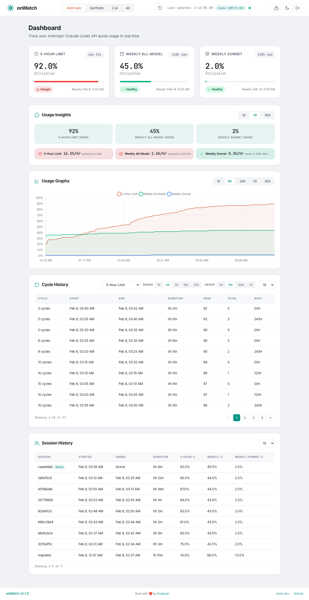

# onWatch

### **[onwatch.onllm.dev](https://onwatch.onllm.dev)**

**onWatch** is a free, open-source CLI tool that tracks [Synthetic](https://synthetic.new), [Z.ai](https://z.ai), and [Anthropic](https://anthropic.com) (Claude Code) API quota usage in real time. It runs as a lightweight background agent (~28 MB RAM with all three providers polling in parallel), stores historical data in SQLite, and serves a Material Design 3 web dashboard with dark/light mode.

onWatch fills the gap between "current usage snapshot" and the historical, per-cycle, cross-session intelligence that developers actually need. It works with any tool that uses Synthetic, Z.ai, or Anthropic API keys, including **Cline**, **Roo Code**, **Kilo Code**, **Claude Code**, **Cursor**, **Windsurf**, and others.

**Zero telemetry. Single binary. All data stays on your machine.**

[](LICENSE)
[](https://go.dev)
[](#quick-start)
[](https://onwatch.onllm.dev)



> Powered by [onllm.dev](https://onllm.dev) | [Landing Page](https://onwatch.onllm.dev)

---

## Quick Start

**One-line install** (macOS and Linux):

```bash
curl -fsSL https://raw.githubusercontent.com/onllm-dev/onwatch/main/install.sh | bash
```

This downloads the binary to `~/.onwatch/`, creates a `.env` config, sets up a systemd service (Linux) or self-daemonizes (macOS), and adds `onwatch` to your PATH.

**Or download manually** from the [Releases](https://github.com/onllm-dev/onwatch/releases) page. Binaries are available for macOS (ARM64, AMD64), Linux (AMD64, ARM64), and Windows (AMD64).

**Or build from source** (requires Go 1.25+):

```bash
git clone https://github.com/onllm-dev/onwatch.git && cd onwatch
cp .env.example .env    # then add your API keys
make build && ./onwatch --debug
```

### Configure

Edit `~/.onwatch/.env` (or `.env` in the project directory if built from source):

```bash
SYNTHETIC_API_KEY=syn_your_key_here       # https://synthetic.new/settings/api
ZAI_API_KEY=your_zai_key_here             # https://www.z.ai/api-keys
ANTHROPIC_TOKEN=your_token_here           # Auto-detected from Claude Code credentials
ONWATCH_ADMIN_USER=admin
ONWATCH_ADMIN_PASS=changeme
```

At least one provider key is required. Configure any combination to track them in parallel. Anthropic tokens are auto-detected from Claude Code credentials (macOS Keychain, Linux keyring, or `~/.claude/.credentials.json`).

### Run

```bash
onwatch              # start in background (daemonizes, logs to ~/.onwatch/.onwatch.log)
onwatch --debug      # foreground mode, logs to stdout
onwatch stop         # stop the running instance
onwatch status       # check if running
```

Open **http://localhost:9211** and log in with your `.env` credentials.

---

## What onWatch Tracks (That Your Provider Doesn't)

```
┌──────────────────────────────────────────────────────────────────┐
│ What your provider shows          │ What onWatch adds           │
├───────────────────────────────────┼──────────────────────────────┤
│ Current quota usage               │ Historical usage trends      │
│                                   │ Reset cycle detection        │
│                                   │ Per-cycle consumption stats  │
│                                   │ Usage rate & projections     │
│                                   │ Per-session tracking         │
│                                   │ Multi-provider unified view  │
│                                   │ Live countdown timers        │
└───────────────────────────────────┴──────────────────────────────┘
```

**Dashboard** -- Material Design 3 with dark/light mode (auto-detects system preference). Provider tabs appear for each configured provider:

- **Synthetic** -- Subscription, Search, and Tool Call quota cards
- **Z.ai** -- Tokens, Time, and Tool Call quota cards
- **Anthropic** -- Dynamic quota cards (5-Hour, 7-Day, 7-Day Sonnet, Monthly, etc.) with utilization percentages
- **All** -- Side-by-side view of all configured providers

Each quota card shows: usage vs. limit with progress bar, live countdown to reset, status badge (healthy/warning/danger/critical), and consumption rate with projected usage.

**Time-series chart** -- Chart.js area chart showing all quotas as % of limit. Time ranges: 1h, 6h, 24h, 7d, 30d.

**Insights** -- Cycle utilization, billing-period usage, weekly pace, tokens-per-call efficiency, and per-tool breakdowns (provider-specific).

**Sessions** -- Every agent run creates a session that tracks peak consumption, letting you compare usage across work periods.

**Dark/Light mode** -- Toggle via sun/moon icon in the header. Auto-detects system preference on first visit and persists your choice across sessions.

**Password management** -- Change your password from the dashboard. The hash is stored in SQLite and persists across restarts (takes precedence over `.env`). To force-reset, delete the row from the `users` table.

**Single binary** -- No runtime dependencies. All templates and static assets embedded via `embed.FS`. SQLite via pure Go driver (no CGO).

---

## Who Is onWatch For?

| Audience | Pain Point | How onWatch Helps |
|----------|-----------|-------------------|
| **Solo developers & freelancers** using Claude Code, Cline, Roo Code, or Kilo Code with Anthropic/Synthetic/Z.ai | Budget anxiety -- no visibility into quota burn rate, surprise throttling mid-task | Real-time rate projections, historical trends, live countdowns so you never get throttled unexpectedly |
| **Small dev teams (3-20 people)** sharing API keys | No shared visibility into who's consuming what, impossible to budget next month | Shared dashboard with session tracking, cycle history for budget planning |
| **DevOps & platform engineers** | Shadow AI usage with no FinOps for coding API subscriptions | Lightweight sidecar (~28 MB), SQLite data source for Grafana, REST API for monitoring stack integration |
| **Privacy-conscious developers** in regulated industries | Can't use SaaS analytics that phone home; need local, auditable monitoring | Single binary, local SQLite, zero telemetry, GPL-3.0 source code, works air-gapped |
| **Researchers & educators** on grants | Need per-session API cost attribution for grant reports and paper methodology | Per-session usage tracking, historical export via SQLite |
| **Budget-conscious API users** paying $3-$60/month | Every request matters; no way to know if plan is underutilized or budget is at risk | Usage insights, plan capacity analysis, upgrade/downgrade recommendations via data |

---

## FAQ

### How do I track my Synthetic API usage?

Install onWatch, set `SYNTHETIC_API_KEY` in your `.env`, and run `./onwatch`. It polls the Synthetic `/v2/quotas` endpoint every 60 seconds, stores historical data in SQLite, and serves a dashboard at `localhost:9211` showing subscription, search, and tool call quotas with live countdowns, rate projections, and reset cycle history.

### How do I monitor Z.ai (GLM Coding Plan) API quota?

Set `ZAI_API_KEY` in your `.env`. onWatch polls the Z.ai `/monitor/usage/quota/limit` endpoint and tracks token limits, time limits, and tool call quotas. All three providers can run simultaneously.

### How do I track my Anthropic (Claude Code) usage?

onWatch auto-detects your Claude Code credentials from the system keychain (macOS) or keyring/file (Linux). Just install and run -- if Claude Code is installed, Anthropic tracking is offered automatically. You can also set `ANTHROPIC_TOKEN` manually in your `.env`. Anthropic quotas are dynamic (5-Hour, 7-Day, Monthly, etc.) and displayed as utilization percentages.

### Does onWatch work with Cline, Roo Code, Kilo Code, or Claude Code?

Yes. onWatch monitors the API provider (Synthetic, Z.ai, or Anthropic), not the coding tool. Any tool that uses a Synthetic, Z.ai, or Anthropic API key -- including Cline, Roo Code, Kilo Code, Claude Code, Cursor, Windsurf, and others -- will have its usage tracked automatically.

### Does onWatch send any data to external servers?

No. Zero telemetry. All data stays in a local SQLite file. The only outbound calls are to the Synthetic, Z.ai, and Anthropic quota APIs you configure. Fully auditable on [GitHub](https://github.com/onllm-dev/onwatch) (GPL-3.0).

### How much memory does onWatch use?

~28 MB idle, ~29 MB under continuous dashboard load. Measured with all three agents (Synthetic, Z.ai, Anthropic) polling in parallel. Lighter than a single browser tab. See [DEVELOPMENT.md](DEVELOPMENT.md) for detailed benchmarks.

---

## Architecture

```
                  ┌──────────────┐
                  │  Dashboard   │
                  │  :9211       │
                  └──────┬───────┘
                  ┌──────┴───────┐
                  │   SQLite     │
                  │   (WAL)      │
                  └──┬────┬────┬─┘
         ┌───────────┘    │    └───────────┐
    ┌────┴─────┐   ┌─────┴─────┐   ┌──────┴─────┐
    │ Synthetic│   │   Z.ai    │   │ Anthropic  │
    │  Agent   │   │   Agent   │   │   Agent    │
    └────┬─────┘   └─────┬─────┘   └──────┬─────┘
    ┌────┴─────┐   ┌─────┴─────┐   ┌──────┴─────┐
    │ Synthetic│   │   Z.ai    │   │ Anthropic  │
    │  API     │   │   API     │   │  OAuth API │
    └──────────┘   └───────────┘   └────────────┘
```

All agents run as parallel goroutines. Each polls its API at the configured interval and writes snapshots. The dashboard reads from the shared store.

**Measured RAM (all three agents running in parallel):** 27.5 MB idle, 29 MB P95 under continuous load (~1,160 requests in 15s). Single binary, all assets embedded via `embed.FS`.

---

## CLI Reference

| Flag | Env Var | Default | Description |
|------|---------|---------|-------------|
| `--interval` | `ONWATCH_POLL_INTERVAL` | `60` | Poll interval in seconds (10--3600) |
| `--port` | `ONWATCH_PORT` | `9211` | Dashboard HTTP port |
| `--db` | `ONWATCH_DB_PATH` | `~/.onwatch/data/onwatch.db` | SQLite database path |
| `--debug` | -- | `false` | Foreground mode, log to stdout |
| `--test` | -- | `false` | Isolated PID/log files for testing |
| `--version` | -- | -- | Print version and exit |

Additional environment variables:

| Variable | Description |
|----------|-------------|
| `ANTHROPIC_TOKEN` | Anthropic OAuth token (auto-detected from Claude Code) |
| `SYNTHETIC_API_KEY` | Synthetic API key |
| `ZAI_API_KEY` | Z.ai API key |
| `ZAI_BASE_URL` | Z.ai base URL (default: `https://api.z.ai/api`) |
| `ONWATCH_ADMIN_USER` | Dashboard username (default: `admin`) |
| `ONWATCH_ADMIN_PASS` | Initial dashboard password (default: `changeme`) |
| `ONWATCH_LOG_LEVEL` | Log level: debug, info, warn, error |
| `ONWATCH_HOST` | Bind address (default: `0.0.0.0`) |

CLI flags override environment variables.

---

## API Endpoints

All endpoints require authentication (session cookie or Basic Auth). Append `?provider=synthetic|zai|anthropic|both` to select the provider.

| Endpoint | Method | Description |
|----------|--------|-------------|
| `/` | GET | Dashboard |
| `/login` | GET/POST | Login page |
| `/logout` | GET | Clear session |
| `/api/current` | GET | Latest snapshot with summaries |
| `/api/history?range=6h` | GET | Historical data for charts |
| `/api/cycles?type=subscription` | GET | Reset cycle history |
| `/api/summary` | GET | Usage summaries |
| `/api/sessions` | GET | Session history |
| `/api/insights` | GET | Usage insights |
| `/api/providers` | GET | Available providers |
| `/api/settings` | GET/PUT | User settings |
| `/api/password` | PUT | Change password |

---

## Data Storage

```
~/.onwatch/
├── onwatch.pid          # PID file
├── .onwatch.log         # Log file (background mode)
└── data/
    └── onwatch.db       # SQLite database (WAL mode)
```

On first run, if a database exists at `./onwatch.db`, onWatch auto-migrates it to `~/.onwatch/data/`.

---

## Security

- API keys loaded from `.env`, never committed, redacted in all log output
- Session-based auth with cookie + Basic Auth fallback
- Passwords stored as SHA-256 hashes with constant-time comparison
- Parameterized SQL queries throughout

---

## Development

See [DEVELOPMENT.md](DEVELOPMENT.md) for build instructions, cross-compilation, and testing.

```bash
make build          # Production binary
make test           # Tests with race detection
make run            # Build and run in debug mode
make release-local  # Cross-compile for all platforms
```

---

## Contributing

1. Fork the repository
2. Create a feature branch: `git checkout -b feat/my-feature`
3. Write tests first, then implement
4. Run `make test` and commit with conventional format
5. Open a Pull Request

---

## License

GNU General Public License v3.0. See [LICENSE](LICENSE).

---

## Acknowledgments

- Powered by [onllm.dev](https://onllm.dev)
- [Anthropic](https://anthropic.com) for the Claude Code API
- [Synthetic](https://synthetic.new) for the API
- [Z.ai](https://z.ai) for the API
- [Chart.js](https://www.chartjs.org/) for charts
- [modernc.org/sqlite](https://pkg.go.dev/modernc.org/sqlite) for pure Go SQLite
