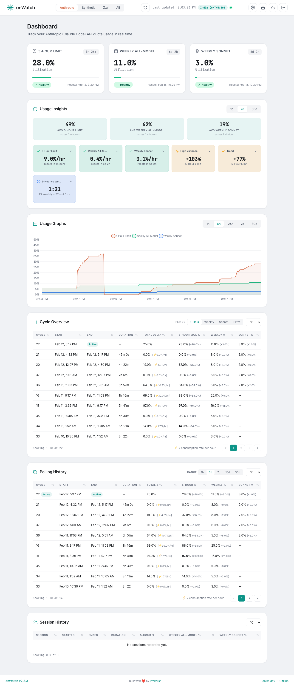

# onWatch

### **[onwatch.onllm.dev](https://onwatch.onllm.dev)**

**onWatch** is a free, open-source CLI tool that tracks [Synthetic](https://synthetic.new), [Z.ai](https://z.ai), [Anthropic](https://anthropic.com) (Claude Code), [Codex](https://openai.com/codex), and [GitHub Copilot](https://github.com/features/copilot) API quota usage in real time. It runs as a lightweight background agent (<50 MB RAM with all five providers polling in parallel), stores historical data in SQLite, and serves a Material Design 3 web dashboard with dark/light mode.

onWatch fills the gap between "current usage snapshot" and the historical, per-cycle, cross-session intelligence that developers actually need. It works with any tool that uses Synthetic, Z.ai, Anthropic, Codex, or GitHub Copilot API keys, including **Cline**, **Roo Code**, **Kilo Code**, **Claude Code**, **Codex CLI**, **Cursor**, **Windsurf**, **GitHub Copilot**, and others.

**Zero telemetry. Single binary. All data stays on your machine.**

> **Beta**: onWatch is currently in active development. Features and APIs may change as we refine the product.

[](LICENSE)
[](https://go.dev)
[](#quick-start)
[](https://onwatch.onllm.dev)
[](https://github.com/onllm-dev/onwatch/releases/tag/v2.10.4)
[](https://buymeacoffee.com/prakersh)

[](https://star-history.com/#onllm-dev/onwatch&Timeline)



> Powered by [onllm.dev](https://onllm.dev) | [Landing Page](https://onwatch.onllm.dev)

---

## Quick Start

**One-line install** (macOS and Linux):

```bash
curl -fsSL https://raw.githubusercontent.com/onllm-dev/onwatch/main/install.sh | bash
```

This downloads the binary to `~/.onwatch/`, creates a `.env` config, sets up a systemd service (Linux) or self-daemonizes (macOS), and adds `onwatch` to your PATH.

**Or download manually** from the [Releases](https://github.com/onllm-dev/onwatch/releases) page. Binaries are available for macOS (ARM64, AMD64), Linux (AMD64, ARM64), and Windows (AMD64).

**Or build from source** (requires Go 1.25+):

```bash
git clone https://github.com/onllm-dev/onwatch.git && cd onwatch
cp .env.example .env    # then add your API keys
./app.sh --build && ./onwatch --debug    # or: make build && ./onwatch --debug
```

**Or use Docker** (requires Docker or Docker Compose):

```bash
cp .env.docker.example .env   # add your API keys
docker-compose up -d
```

Or via `app.sh`:

```bash
./app.sh --docker --run
```

The Docker image uses a distroless base (~10-12 MB) and runs as non-root. Data persists via volume mount at `/data`. Logs go to stdout (`docker logs -f onwatch`). See [Docker Deployment](#docker-deployment) for details.

### Configure

Edit `~/.onwatch/.env` (or `.env` in the project directory if built from source):

```bash
SYNTHETIC_API_KEY=syn_your_key_here       # https://synthetic.new/settings/api
ZAI_API_KEY=your_zai_key_here             # https://www.z.ai/api-keys
ANTHROPIC_TOKEN=your_token_here           # Auto-detected from Claude Code credentials
CODEX_TOKEN=your_token_here               # Recommended for Codex-only setups
COPILOT_TOKEN=ghp_your_token_here         # GitHub PAT with copilot scope (Beta)
ONWATCH_ADMIN_USER=admin
ONWATCH_ADMIN_PASS=changeme
```

At least one provider key is required. Configure any combination to track them in parallel. Anthropic tokens are auto-detected from Claude Code credentials (macOS Keychain, Linux keyring, or `~/.claude/.credentials.json`). For Codex-only setups, set `CODEX_TOKEN` in `.env`; during runtime onWatch re-reads Codex auth state from `~/.codex/auth.json` (or `CODEX_HOME/auth.json`) and picks up token changes. Copilot tokens require a GitHub Personal Access Token (classic) with the `copilot` scope.

Provider setup guides:
- [Codex Setup Guide](docs/CODEX_SETUP.md)
- [Copilot Setup Guide](docs/COPILOT_SETUP.md)

### Run

```bash
onwatch              # start in background (daemonizes, logs to ~/.onwatch/.onwatch.log)
onwatch --debug      # foreground mode, logs to stdout
onwatch stop         # stop the running instance
onwatch status       # check if running
```

Open **http://localhost:9211** and log in with your `.env` credentials.

---

## What onWatch Tracks (That Your Provider Doesn't)

```
┌──────────────────────────────────────────────────────────────────┐
│ What your provider shows          │ What onWatch adds           │
├───────────────────────────────────┼──────────────────────────────┤
│ Current quota usage               │ Historical usage trends      │
│                                   │ Reset cycle detection        │
│                                   │ Per-cycle consumption stats  │
│                                   │ Usage rate & projections     │
│                                   │ Per-session tracking         │
│                                   │ Multi-provider unified view  │
│                                   │ Live countdown timers        │
└───────────────────────────────────┴──────────────────────────────┘
```

**Dashboard** -- Material Design 3 with dark/light mode (auto-detects system preference). Provider tabs appear for each configured provider:

- **Synthetic** -- Subscription, Search, and Tool Call quota cards
- **Z.ai** -- Tokens, Time, and Tool Call quota cards
- **Anthropic** -- Dynamic quota cards (5-Hour, 7-Day, 7-Day Sonnet, Monthly, etc.) with utilization percentages and OAuth token auto-refresh
- **Codex** -- Dynamic quota cards (5-Hour, 7-Day) with OAuth auth-state refresh and historical cycle analytics
- **GitHub Copilot (Beta)** -- Premium Interactions, Chat, and Completions quota cards with monthly reset tracking
- **All** -- Side-by-side view of all configured providers
- **PWA installable** -- Install onWatch from your browser for a native app experience (Beta)

Each quota card shows: usage vs. limit with progress bar, live countdown to reset, status badge (healthy/warning/danger/critical), and consumption rate with projected usage.

**Time-series chart** -- Chart.js area chart showing all quotas as % of limit. Time ranges: 1h, 6h, 24h, 7d, 30d.

**Insights** -- Burn rate forecasting, billing-period averages, usage variance, trend detection, and cross-quota ratio analysis (e.g., "1% weekly ~ 24% of 5-hr sprint"). Provider-specific: tokens-per-call efficiency and per-tool breakdowns for Z.ai.

**Cycle Overview** -- Cross-quota correlation table showing all quota values at peak usage points within each billing period. Helps identify which quotas spike together.

**Sessions** -- Every agent run creates a session that tracks peak consumption, letting you compare usage across work periods.

**Settings** -- Dedicated settings page (`/settings`) with tabs for general preferences, provider controls, notification thresholds, and SMTP email configuration.

**Email notifications (Beta)** -- Configure SMTP to receive alerts when quotas cross warning or critical thresholds, or when quotas reset. Per-quota threshold overrides for fine-grained control. SMTP passwords are encrypted at rest with AES-GCM.

**Push notifications (Beta)** -- Receive browser push notifications when quotas cross thresholds. onWatch is a PWA (Progressive Web App) — install it from your browser for a native app experience. Uses Web Push protocol (VAPID) with zero external dependencies. Configure delivery channels (email, push, or both) per your preference.

**Dark/Light mode** -- Toggle via sun/moon icon in the header. Auto-detects system preference on first visit and persists your choice across sessions.

**Password management** -- Change your password from the dashboard. The hash is stored in SQLite and persists across restarts (takes precedence over `.env`). To force-reset, delete the row from the `users` table.

**Single binary** -- No runtime dependencies. All templates and static assets embedded via `embed.FS`. SQLite via pure Go driver (no CGO).

---

## Who Is onWatch For?

| Audience                                                                                                                 | Pain Point                                                                          | How onWatch Helps                                                                                       |
| ------------------------------------------------------------------------------------------------------------------------ | ----------------------------------------------------------------------------------- | ------------------------------------------------------------------------------------------------------- |
| **Solo developers & freelancers** using Claude Code, Cline, Roo Code, or Kilo Code with Anthropic/Synthetic/Z.ai/Codex/Copilot | Budget anxiety -- no visibility into quota burn rate, surprise throttling mid-task  | Real-time rate projections, historical trends, live countdowns so you never get throttled unexpectedly  |
| **Small dev teams (3-20 people)** sharing API keys                                                                       | No shared visibility into who's consuming what, impossible to budget next month     | Shared dashboard with session tracking, cycle history for budget planning                               |
| **DevOps & platform engineers**                                                                                          | Shadow AI usage with no FinOps for coding API subscriptions                         | Lightweight sidecar (<50 MB), SQLite data source for Grafana, REST API for monitoring stack integration |
| **Privacy-conscious developers** in regulated industries                                                                 | Can't use SaaS analytics that phone home; need local, auditable monitoring          | Single binary, local SQLite, zero telemetry, GPL-3.0 source code, works air-gapped                      |
| **Researchers & educators** on grants                                                                                    | Need per-session API cost attribution for grant reports and paper methodology       | Per-session usage tracking, historical export via SQLite                                                |
| **Budget-conscious API users** paying $3-$60/month                                                                       | Every request matters; no way to know if plan is underutilized or budget is at risk | Usage insights, plan capacity analysis, upgrade/downgrade recommendations via data                      |

---

## FAQ

### How do I track my Synthetic API usage?

Install onWatch, set `SYNTHETIC_API_KEY` in your `.env`, and run `./onwatch`. It polls the Synthetic `/v2/quotas` endpoint every 60 seconds, stores historical data in SQLite, and serves a dashboard at `localhost:9211` showing subscription, search, and tool call quotas with live countdowns, rate projections, and reset cycle history.

### How do I monitor Z.ai (GLM Coding Plan) API quota?

Set `ZAI_API_KEY` in your `.env`. onWatch polls the Z.ai `/monitor/usage/quota/limit` endpoint and tracks token limits, time limits, and tool call quotas. All providers can run simultaneously.

### How do I track my Anthropic (Claude Code) usage?

onWatch auto-detects your Claude Code credentials from the system keychain (macOS) or keyring/file (Linux). Just install and run -- if Claude Code is installed, Anthropic tracking is offered automatically. You can also set `ANTHROPIC_TOKEN` manually in your `.env`. Anthropic quotas are dynamic (5-Hour, 7-Day, Monthly, etc.) and displayed as utilization percentages. OAuth tokens are automatically refreshed before expiry, and onWatch gracefully handles auth failures with automatic retry when new credentials are detected.

### How do I track my Codex usage?

Set `CODEX_TOKEN` in your `.env` (recommended for Codex-only installs). You can retrieve it from `~/.codex/auth.json` (`tokens.access_token`) or from `$CODEX_HOME/auth.json` if you use a custom Codex home. onWatch re-reads Codex credentials while running, so token rotation is picked up automatically. Full walkthrough: [Codex Setup Guide](docs/CODEX_SETUP.md).

### How do I track my GitHub Copilot premium request usage?

Set `COPILOT_TOKEN` in your `.env` with a GitHub Personal Access Token (classic) that has the `copilot` scope. Generate one at [github.com/settings/tokens](https://github.com/settings/tokens). onWatch polls the GitHub Copilot internal API to track premium interactions, chat, and completions quotas with monthly reset cycle detection. This feature is in beta and uses an undocumented API.

### Does onWatch work with Cline, Roo Code, Kilo Code, or Claude Code?

Yes. onWatch monitors the API provider (Synthetic, Z.ai, Anthropic, Codex, or GitHub Copilot), not the coding tool. Any tool that uses a Synthetic, Z.ai, Anthropic, Codex, or Copilot API key -- including Cline, Roo Code, Kilo Code, Claude Code, Codex CLI, Cursor, Windsurf, GitHub Copilot, and others -- will have its usage tracked automatically.

### Does onWatch send any data to external servers?

No. Zero telemetry. All data stays in a local SQLite file. The only outbound calls are to the Synthetic, Z.ai, Anthropic, Codex, and GitHub Copilot quota APIs you configure. Fully auditable on [GitHub](https://github.com/onllm-dev/onwatch) (GPL-3.0).

### How much memory does onWatch use?

<50 MB under all conditions (typically ~34 MB idle, ~43 MB under heavy load). Measured with all five agents (Synthetic, Z.ai, Anthropic, Codex, GitHub Copilot) polling in parallel. Lighter than a single browser tab. See [DEVELOPMENT.md](docs/DEVELOPMENT.md) for detailed benchmarks.

---

## Architecture

```text
                  ┌──────────────┐
                  │  Dashboard   │
                  │  :9211       │
                  └──────┬───────┘
                  ┌──────┴───────┐
                  │   SQLite     │
                  │   (WAL)      │
                  └──┬──┬──┬──┬──┬─┘
       ┌────────────┘  │  │  │  └────────────┐
  ┌────┴─────┐  ┌──────┴──┐  ┌──────┴──┐  ┌──────┴──┐  ┌──────┴──┐
  │ Synthetic│  │  Z.ai   │  │Anthropic│  │  Codex  │  │ Copilot │
  │  Agent   │  │  Agent  │  │  Agent  │  │  Agent  │  │  Agent  │
  └────┬─────┘  └────┬────┘  └────┬────┘  └────┬────┘  └────┬────┘
  ┌────┴─────┐  ┌────┴────┐  ┌────┴────┐  ┌────┴────┐  ┌────┴────┐
  │ Synthetic│  │  Z.ai   │  │Anthropic│  │chatgpt  │  │ GitHub  │
  │  API     │  │  API    │  │OAuth API│  │OAuth API│  │Copilot  │
  └──────────┘  └─────────┘  └─────────┘  └─────────┘  └─────────┘
```

All agents run as parallel goroutines. Each polls its API at the configured interval and writes snapshots. The dashboard reads from the shared store.

**Measured RAM (all five agents running in parallel):** ~34 MB idle, ~43 MB under heavy load. Single binary, all assets embedded via `embed.FS`.

---

## CLI Reference

| Flag         | Env Var                 | Default                      | Description                         |
| ------------ | ----------------------- | ---------------------------- | ----------------------------------- |
| `--interval` | `ONWATCH_POLL_INTERVAL` | `60`                         | Poll interval in seconds (10--3600) |
| `--port`     | `ONWATCH_PORT`          | `9211`                       | Dashboard HTTP port                 |
| `--db`       | `ONWATCH_DB_PATH`       | `~/.onwatch/data/onwatch.db` | SQLite database path                |
| `--debug`    | --                      | `false`                      | Foreground mode, log to stdout      |
| `--test`     | --                      | `false`                      | Isolated PID/log files for testing  |
| `--version`  | --                      | --                           | Print version and exit              |

Additional environment variables:

| Variable             | Description                                            |
| -------------------- | ------------------------------------------------------ |
| `ANTHROPIC_TOKEN`    | Anthropic OAuth token (auto-detected from Claude Code) |
| `CODEX_TOKEN`        | Codex OAuth access token (recommended for Codex-only)  |
| `COPILOT_TOKEN`      | GitHub Copilot PAT with `copilot` scope (Beta)         |
| `SYNTHETIC_API_KEY`  | Synthetic API key                                      |
| `ZAI_API_KEY`        | Z.ai API key                                           |
| `ZAI_BASE_URL`       | Z.ai base URL (default: `https://api.z.ai/api`)        |
| `ONWATCH_ADMIN_USER` | Dashboard username (default: `admin`)                  |
| `ONWATCH_ADMIN_PASS` | Initial dashboard password (default: `changeme`)       |
| `ONWATCH_LOG_LEVEL`  | Log level: debug, info, warn, error                    |
| `ONWATCH_HOST`       | Bind address (default: `0.0.0.0`)                      |

CLI flags override environment variables.

---

## API Endpoints

All endpoints require authentication (session cookie or Basic Auth). Append `?provider=synthetic|zai|anthropic|codex|copilot|both` to select the provider.

| Endpoint                        | Method      | Description                                    |
| ------------------------------- | ----------- | ---------------------------------------------- |
| `/`                             | GET         | Dashboard                                      |
| `/settings`                     | GET         | Settings page                                  |
| `/login`                        | GET/POST    | Login page                                     |
| `/logout`                       | GET         | Clear session                                  |
| `/api/current`                  | GET         | Latest snapshot with summaries                 |
| `/api/history?range=6h`         | GET         | Historical data for charts                     |
| `/api/cycles?type=subscription` | GET         | Reset cycle history                            |
| `/api/cycle-overview`           | GET         | Cross-quota correlation at peak usage          |
| `/api/summary`                  | GET         | Usage summaries                                |
| `/api/sessions`                 | GET         | Session history                                |
| `/api/insights`                 | GET         | Usage insights                                 |
| `/api/providers`                | GET         | Available providers                            |
| `/api/settings`                 | GET/PUT     | User settings (notifications, SMTP, providers) |
| `/api/settings/smtp/test`       | POST        | Send test email via configured SMTP            |
| `/api/password`                 | PUT         | Change password                                |
| `/api/push/vapid`               | GET         | Get VAPID public key for push subscription     |
| `/api/push/subscribe`           | POST/DELETE | Subscribe/unsubscribe push endpoint            |
| `/api/push/test`                | POST        | Send test push notification                    |
| `/api/update/check`             | GET         | Check for new version                          |
| `/api/update/apply`             | POST        | Download and apply update                      |

---

## Self-Update

onWatch can update itself from the dashboard or CLI:

```bash
onwatch update    # Check for updates and self-update from CLI
```

Or click the update badge in the dashboard footer when a new version is available.

**Under systemd**, the update is fully automatic — no manual restart needed. onWatch detects its systemd service via `/proc/self/cgroup`, fixes the unit file if needed (`Restart=always`), runs `systemctl daemon-reload`, and triggers `systemctl restart` for a clean lifecycle-managed restart.

**Standalone mode** (macOS, or Linux without systemd) spawns the new binary, which takes over via PID file. If the spawn fails, onWatch automatically falls back to `systemctl restart` as a safety net.

The binary validates downloaded updates by checking executable magic bytes (ELF, Mach-O, PE) before replacing itself.

**If a self-update fails to restart**, the new binary is already on disk — just restart the service manually:

```bash
# systemd (Linux)
sudo systemctl restart onwatch

# Standalone (macOS / Linux without systemd)
onwatch stop && onwatch
```

---

## Data Storage

```shell
~/.onwatch/
├── onwatch.pid          # PID file
├── .onwatch.log         # Log file (background mode)
└── data/
    └── onwatch.db       # SQLite database (WAL mode)
```

On first run, if a database exists at `./onwatch.db`, onWatch auto-migrates it to `~/.onwatch/data/`.

---

## Docker Deployment

The container auto-detects the Docker environment and runs in foreground mode with stdout logging.

> [!NOTE]
> onWatch provides Docker support with a distroless runtime image (~10-12 MB).
> You will almost certainly need to account for file permissions when using bind mounts for the SQLite database, as the container runs as non-root (UID 65532).
> See [Storage](#storage) below for details.

### Quick Start

**Using pre-built images from GitHub Container Registry:**

Multi-arch images (linux/amd64, linux/arm64) are automatically built and published on each release:

```bash
# Pull and run the latest release
docker run -d --name onwatch -p 9211:9211 \
  -v onwatch-data:/data \
  -e SYNTHETIC_API_KEY=your_key_here \
  ghcr.io/onllm-dev/onwatch:latest
```

**Docker Compose (recommended):**

```bash
git clone https://github.com/onllm-dev/onwatch.git && cd onwatch
cp .env.docker.example .env
nano .env  # Add your API keys
docker-compose up -d
docker-compose logs -f
```

**Using app.sh:**

```bash
./app.sh --docker --build      # Build Docker image
./app.sh --docker --run        # Build + start container
./app.sh --docker --stop       # Stop container
./app.sh --docker --clean      # Remove container and image
```

**Manual Docker run:**

```bash
docker build -t onwatch:latest .
docker run -d --name onwatch -p 9211:9211 \
  -v ./onwatch-data:/data \
  --env-file .env \
  onwatch:latest
```

### Configuration

Copy `.env.docker.example` to `.env` and set at least one provider key. See `.env.docker.example` for all available options. Key variables:

| Variable                | Description                                | Default    |
| ----------------------- | ------------------------------------------ | ---------- |
| `SYNTHETIC_API_KEY`     | Synthetic API key                          | --         |
| `ZAI_API_KEY`           | Z.ai API key                               | --         |
| `ANTHROPIC_TOKEN`       | Anthropic token (auto-detected if not set) | --         |
| `CODEX_TOKEN`           | Codex OAuth access token (recommended; required for Codex-only) | -- |
| `ONWATCH_ADMIN_USER`    | Dashboard username                         | `admin`    |
| `ONWATCH_ADMIN_PASS`    | Dashboard password                         | `changeme` |
| `ONWATCH_POLL_INTERVAL` | Polling interval (seconds)                 | `60`       |
| `ONWATCH_LOG_LEVEL`     | Log level                                  | `info`     |

### Storage

The container runs as non-root (UID 65532). The SQLite database is stored at `/data/onwatch.db` and must be persisted via a volume mount.

The `docker-compose.yml` uses a bind mount at `./onwatch-data/`:

```bash
# Pre-create with correct ownership
mkdir -p ./onwatch-data && sudo chown -R 65532:65532 ./onwatch-data
```

Alternatively, use a named volume for simpler permissions handling:

```bash
docker run -d --name onwatch -p 9211:9211 \
  -v onwatch-data:/data \
  --env-file .env \
  onwatch:latest
```

### Resource Limits

The `docker-compose.yml` includes memory limits (64M limit, 32M reservation), log rotation (10 MB, 3 files), and `unless-stopped` restart policy.

### Troubleshooting

**Database errors:** Pre-create bind mount directories with `sudo chown 65532:65532` or use named volumes.
**Container won't start:** Check `docker-compose logs -f`; verify API keys in `.env` and port 9211 availability.
**Debugging:** The distroless image has no shell — use a sidecar: `docker run -it --rm --pid=container:onwatch --net=container:onwatch nicolaka/netshoot bash`

---

## Security

- API keys loaded from `.env`, never committed, redacted in all log output
- Session-based auth with cookie + Basic Auth fallback
- Passwords stored as SHA-256 hashes with constant-time comparison
- SMTP passwords encrypted at rest with AES-256-GCM (key derived from admin password)
- VAPID keys auto-generated (ECDSA P-256) and stored in database
- Web Push payloads encrypted per RFC 8291 (ECDH + HKDF + AES-128-GCM)
- Parameterized SQL queries throughout

---

## Development

See [DEVELOPMENT.md](docs/DEVELOPMENT.md) for build instructions, cross-compilation, and testing.

```bash
./app.sh --build       # Production binary        (or: make build)
./app.sh --test        # Tests with race detection (or: make test)
./app.sh --build --run # Build + run debug mode    (or: make run)
./app.sh --release     # Cross-compile all platforms (or: make release-local)
```

---

## Contributing

1. Fork the repository
2. Create a feature branch: `git checkout -b feat/my-feature`
3. Write tests first, then implement
4. Run `./app.sh --test` and commit with conventional format
5. Open a Pull Request

---

## License

GNU General Public License v3.0. See [LICENSE](LICENSE).

---

## Support

If onWatch saves you time, consider buying me a coffee:

[](https://buymeacoffee.com/prakersh)

---

## Acknowledgments

- Powered by [onllm.dev](https://onllm.dev)
- [Anthropic](https://anthropic.com) for the Claude Code API
- [Synthetic](https://synthetic.new) for the API
- [Z.ai](https://z.ai) for the API
- [Chart.js](https://www.chartjs.org/) for charts
- [modernc.org/sqlite](https://pkg.go.dev/modernc.org/sqlite) for pure Go SQLite
