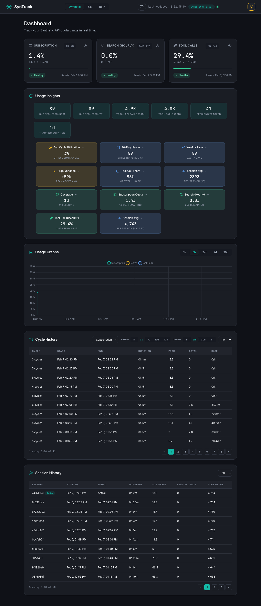

# SynTrack

Track your [Synthetic](https://synthetic.new) and [Z.ai](https://z.ai) API usage. A lightweight background agent that polls quota data, stores it in SQLite, and serves a Material Design dashboard.



> Powered by [onllm.dev](https://onllm.dev)

---

## Why SynTrack

API providers show current quota usage but not historical trends or per-cycle consumption. SynTrack fills this gap:

- Track usage across reset cycles for Synthetic and Z.ai
- See which quotas approach limits with rate projections
- View both providers side-by-side in a unified "Both" view
- Monitor in real-time with live countdowns
- Change admin password from the dashboard (stored in DB, persists across restarts)
- Run silently in the background (~25 MB RAM idle, ~28 MB with dashboard)

---

## Features

| Feature | Description |
|---------|-------------|
| Multi-provider | Supports Synthetic and Z.ai; runs both in parallel |
| "Both" view | Side-by-side dashboard showing all quotas from both providers |
| Background polling | Polls quota APIs every 60 seconds (configurable) |
| Reset detection | Detects quota resets for both providers and tracks per-cycle usage |
| Rate & projection | Current consumption rate and projected usage before reset |
| Live countdown | Real-time timers for all quota types |
| Material Design 3 | Dashboard with dark and light mode |
| Time-series chart | Chart.js area chart with 1h, 6h, 24h, 7d, 30d ranges |
| Usage insights | Provider-specific stats: plan capacity, tokens-per-call, cycle utilization |
| Session tracking | Track consumption per agent session |
| Password management | Change password from dashboard footer; DB-stored hash persists across restarts |
| SQLite storage | Append-only log, WAL mode, server-side pagination |
| Single binary | No runtime dependencies, all assets embedded |

---

## Quick Start

### 1. Download or Build

**Option A: Download a release binary**

Binaries are available for macOS (ARM64, AMD64), Linux (AMD64, ARM64), and Windows (AMD64).

```bash
# macOS ARM64 example
curl -L -o syntrack https://github.com/onllm-dev/syntrack/releases/latest/download/syntrack-darwin-arm64
chmod +x syntrack
```

See the [Releases](https://github.com/onllm-dev/syntrack/releases) page for all platforms.

**Option B: Build from source**

Requires Go 1.25 or later.

```bash
git clone https://github.com/onllm-dev/syntrack.git
cd syntrack
make build
```

### 2. Configure

Copy the example environment file and set your API keys:

```bash
cp .env.example .env
```

Edit `.env`:

```bash
# Synthetic API (get key from https://synthetic.new/settings/api)
SYNTHETIC_API_KEY=syn_your_actual_key_here

# Z.ai API (get key from https://www.z.ai/api-keys)
ZAI_API_KEY=your_zai_api_key_here

# Dashboard credentials
SYNTRACK_ADMIN_USER=admin
SYNTRACK_ADMIN_PASS=your_secure_password_here
```

At least one provider key is required. Configure both to run them in parallel.

### 3. Run

**Background mode (default):**
```bash
./syntrack
```

Logs go to `~/.syntrack/.syntrack.log`. The process daemonizes automatically.

**Foreground/debug mode:**
```bash
./syntrack --debug
```

**Custom settings:**
```bash
./syntrack --interval 30 --port 8080
```

### 4. View Dashboard

Open http://localhost:9211 and log in with your `.env` credentials.

If both providers are configured, use the provider tabs in the header to switch between Synthetic, Z.ai, and Both views.

### 5. Stop or Check Status

```bash
./syntrack stop      # Stop the running instance
./syntrack status    # Check if syntrack is running
```

---

## CLI Reference

### Commands

| Command | Description |
|---------|-------------|
| `syntrack` | Start the agent (background mode) |
| `syntrack stop` or `--stop` | Stop the running instance |
| `syntrack status` or `--status` | Show running instance status |

### Options

| Flag | Env Var | Default | Description |
|------|---------|---------|-------------|
| `--interval` | `SYNTRACK_POLL_INTERVAL` | `60` | Polling interval in seconds (10-3600) |
| `--port` | `SYNTRACK_PORT` | `9211` | Dashboard HTTP port |
| `--db` | `SYNTRACK_DB_PATH` | `~/.syntrack/data/syntrack.db` | SQLite database path |
| `--debug` | - | `false` | Run in foreground, log to stdout |
| `--test` | - | `false` | Test mode: isolated PID/log files |
| `--version` | - | - | Print version and exit |
| `--help` | - | - | Print help and exit |

CLI flags override environment variables.

### Environment Variables

| Variable | Description |
|----------|-------------|
| `SYNTHETIC_API_KEY` | Synthetic API key |
| `ZAI_API_KEY` | Z.ai API key |
| `ZAI_BASE_URL` | Z.ai base URL (default: `https://api.z.ai/api`) |
| `SYNTRACK_POLL_INTERVAL` | Polling interval in seconds |
| `SYNTRACK_PORT` | Dashboard HTTP port |
| `SYNTRACK_ADMIN_USER` | Dashboard username (default: `admin`) |
| `SYNTRACK_ADMIN_PASS` | Initial dashboard password (default: `changeme`) |
| `SYNTRACK_DB_PATH` | SQLite database path |
| `SYNTRACK_LOG_LEVEL` | Log level: debug, info, warn, error |
| `SYNTRACK_HOST` | Bind address (default: `0.0.0.0`) |

---

## Data Storage

SynTrack stores all data in `~/.syntrack/data/syntrack.db` by default. On first run, if a database exists at the old default location (`./syntrack.db`), SynTrack auto-migrates it to the new path.

Override with `--db` or `SYNTRACK_DB_PATH` to use a custom location.

```
~/.syntrack/
├── syntrack.pid              # PID file
├── .syntrack.log             # Log file (background mode)
└── data/
    └── syntrack.db           # SQLite database
```

---

## Password Management

On first run, SynTrack hashes the `.env` password (SHA-256) and stores it in the database `users` table.

On subsequent runs, the DB-stored password takes precedence over `.env`. This means:

1. Change your password from the dashboard footer ("Change Password" button)
2. The new password persists in the database
3. Restarting the app or changing `.env` will not overwrite it
4. To force-reset the password, delete the `users` table row in SQLite

---

## Dashboard

### Provider Tabs

When both Synthetic and Z.ai are configured, tab buttons in the header switch between:

- **Synthetic** -- Subscription, Search, and Tool Call quota cards
- **Z.ai** -- Tokens, Time, and Tool Call quota cards
- **Both** -- Side-by-side view of all quotas from both providers

### Quota Cards

Each card shows:
- Current usage vs. limit with color-coded progress bar
- Live countdown to next reset
- Status badge (healthy / warning / danger / critical)
- Consumption rate and projected usage

### Usage Insights

Provider-specific stat cards and expandable insight cards. Synthetic insights cover cycle utilization, billing-period usage, weekly pace, and tool call share. Z.ai insights show plan capacity, tokens-per-call efficiency, and per-tool breakdowns.

### Footer

The footer displays the SynTrack version and a "Change Password" button that opens a modal for updating the admin password.

### Dark/Light Mode

- Toggle via sun/moon icon in the header
- Detects system preference on first visit
- Persists across sessions

---

## Architecture

```
                    +------------------+
                    |   Dashboard      |
                    |  :9211           |
                    +--------+---------+
                             |
                    +--------+---------+
                    |   Store          |
                    |  (SQLite)        |
                    +---+----------+---+
                        |          |
              +---------+--+ +--+----------+
              | Synthetic   | |  Z.ai       |
              | Agent       | |  Agent      |
              +--------+---+ +---+---------+
                       |         |
              +--------+---+ +---+---------+
              | Synthetic   | |  Z.ai       |
              | API         | |  API        |
              +------------+ +-------------+
```

Both agents run in parallel goroutines. Each polls its API at the configured interval and stores snapshots. The dashboard reads from the shared SQLite store.

**RAM budget:** ~30 MB idle, ~50 MB during dashboard render.

---

## API Endpoints

All endpoints require authentication (session cookie or Basic Auth).

Append `?provider=synthetic`, `?provider=zai`, or `?provider=both` to select the provider.

| Endpoint | Method | Description |
|----------|--------|-------------|
| `/` | GET | Dashboard HTML page |
| `/login` | GET/POST | Login page |
| `/logout` | GET | Logout (clears session) |
| `/api/providers` | GET | Available providers list |
| `/api/current` | GET | Latest snapshot with summaries |
| `/api/history?range=6h` | GET | Historical data for charts |
| `/api/cycles?type=subscription` | GET | Reset cycle history |
| `/api/summary` | GET | Usage summaries for all quotas |
| `/api/sessions` | GET | Session history |
| `/api/insights` | GET | Usage insights |
| `/api/settings` | GET/PUT | User settings (provider preference) |
| `/api/password` | PUT | Change admin password |

---

## Security

- API keys loaded from `.env` (never committed)
- API keys redacted in all log output
- Session-based auth with cookie + Basic Auth fallback for API endpoints
- Passwords stored as SHA-256 hashes in SQLite `users` table
- Constant-time comparison for all credential checks
- Parameterized SQL queries throughout

---

## Development

See [DEVELOPMENT.md](DEVELOPMENT.md) for build instructions, cross-compilation, and performance monitoring.

```bash
make build          # Build production binary
make test           # Run tests with race detection
make run            # Build and run in debug mode
make clean          # Remove artifacts
make release-local  # Cross-compile for all 5 platforms
```

---

## Contributing

1. Fork the repository
2. Create a feature branch: `git checkout -b feat/my-feature`
3. Write tests first (TDD)
4. Run tests: `make test`
5. Commit with conventional format: `feat: add feature X`
6. Push and create a Pull Request

---

## License

MIT License. See [LICENSE](LICENSE).

---

## Acknowledgments

- Powered by [onllm.dev](https://onllm.dev)
- [Synthetic](https://synthetic.new) for the API
- [Z.ai](https://z.ai) for the API
- [Chart.js](https://www.chartjs.org/) for charts
- [modernc.org/sqlite](https://pkg.go.dev/modernc.org/sqlite) for pure Go SQLite
