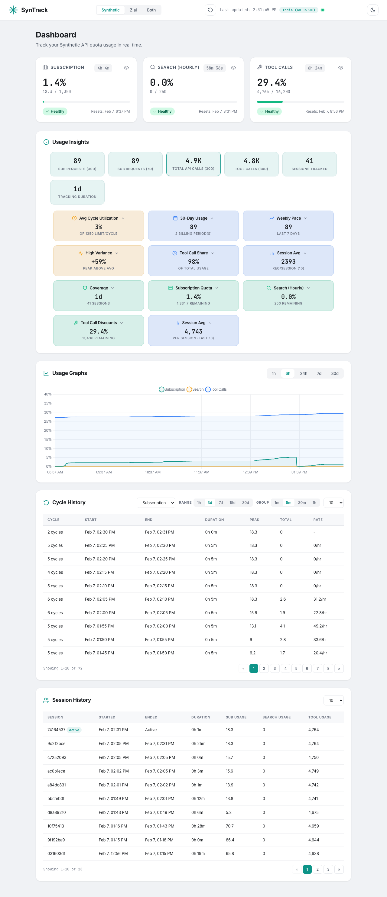
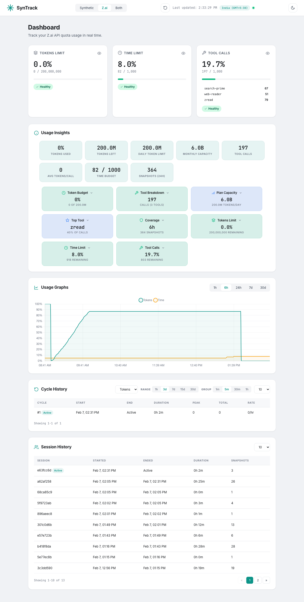

# SynTrack

Track your [Synthetic](https://synthetic.new) and [Z.ai](https://z.ai) API usage. A lightweight background agent that polls quota data, stores it in SQLite, and serves a Material Design dashboard.



> Powered by [onllm.dev](https://onllm.dev)

---

## Why SynTrack

API providers show current quota usage but not historical trends or per-cycle consumption. SynTrack fills this gap:

- Track usage across reset cycles for Synthetic and Z.ai
- See which quotas approach limits with rate projections
- View both providers side-by-side in a unified "Both" view
- Monitor in real-time with live countdowns
- Full cycle tracking for both providers with reset detection
- Run silently in the background (~26 MB RAM idle, ~28 MB with dashboard)

---

## Features

| Feature | Description |
|---------|-------------|
| Multi-provider | Supports Synthetic and Z.ai; runs both in parallel |
| "Both" view | Side-by-side dashboard showing all quotas from both providers |
| Background polling | Polls quota APIs every 60 seconds (configurable) |
| Reset detection | Detects quota resets for both providers and tracks per-cycle usage |
| Z.ai cycle tracking | Token reset detection via next-reset-time, time reset via value-drop |
| Rate & projection | Current consumption rate and projected usage before reset |
| Live countdown | Real-time timers for all quota types |
| Material Design 3 | Dashboard with dark and light mode |
| Time-series chart | Chart.js area chart with 1h, 6h, 24h, 7d, 30d ranges; dual charts in Both view |
| Usage insights | Provider-specific stats: plan capacity, tokens-per-call, cycle utilization |
| Session tracking | Track consumption per agent session |
| SQLite storage | Append-only log, WAL mode, server-side pagination |
| Single binary | No runtime dependencies, all assets embedded |
| Provider tabs | Tab selector to switch between Synthetic, Z.ai, and Both views |

---

## Quick Start

### 1. Download or Build

**Option A: Download a release binary**

Binaries are available for macOS (ARM64, AMD64), Linux (AMD64, ARM64), and Windows (AMD64).

```bash
# macOS ARM64 example
curl -L -o syntrack https://github.com/onllm-dev/syntrack/releases/latest/download/syntrack-darwin-arm64
chmod +x syntrack
```

See the [Releases](https://github.com/onllm-dev/syntrack/releases) page for all platforms.

**Option B: Build from source**

Requires Go 1.25 or later.

```bash
git clone https://github.com/onllm-dev/syntrack.git
cd syntrack
make build
```

### 2. Configure

Copy the example environment file and set your API keys:

```bash
cp .env.example .env
```

Edit `.env`:

```bash
# Synthetic API (get key from https://synthetic.new/settings/api)
SYNTHETIC_API_KEY=syn_your_actual_key_here

# Z.ai API (get key from https://www.z.ai/api-keys)
ZAI_API_KEY=your_zai_api_key_here

# Dashboard credentials
SYNTRACK_ADMIN_USER=admin
SYNTRACK_ADMIN_PASS=your_secure_password_here
```

At least one provider key is required. Configure both to run them in parallel.

### 3. Run

**Background mode (default):**
```bash
./syntrack
```

Logs go to `.syntrack.log`. The process daemonizes automatically.

**Foreground/debug mode:**
```bash
./syntrack --debug
```

**Custom settings:**
```bash
./syntrack --interval 30 --port 8080
```

### 4. View Dashboard

Open http://localhost:9211 and log in with your `.env` credentials.

If both providers are configured, use the provider tabs in the header to switch between Synthetic, Z.ai, and Both views.

### 5. Stop or Check Status

```bash
./syntrack stop      # Stop the running instance
./syntrack status    # Check if syntrack is running
```

---

## CLI Reference

### Commands

| Command | Description |
|---------|-------------|
| `syntrack` | Start the agent (background mode) |
| `syntrack stop` | Stop the running instance |
| `syntrack status` | Show running instance status |

### Options

| Flag | Env Var | Default | Description |
|------|---------|---------|-------------|
| `--interval` | `SYNTRACK_POLL_INTERVAL` | `60` | Polling interval in seconds (10-3600) |
| `--port` | `SYNTRACK_PORT` | `9211` | Dashboard HTTP port |
| `--db` | `SYNTRACK_DB_PATH` | `./syntrack.db` | SQLite database path |
| `--debug` | - | `false` | Run in foreground, log to stdout |
| `--version` | - | - | Print version and exit |

CLI flags override environment variables.

### Environment Variables

| Variable | Description |
|----------|-------------|
| `SYNTHETIC_API_KEY` | Synthetic API key |
| `ZAI_API_KEY` | Z.ai API key |
| `ZAI_BASE_URL` | Z.ai base URL (default: `https://api.z.ai/api`) |
| `SYNTRACK_POLL_INTERVAL` | Polling interval in seconds |
| `SYNTRACK_PORT` | Dashboard HTTP port |
| `SYNTRACK_ADMIN_USER` | Dashboard username |
| `SYNTRACK_ADMIN_PASS` | Dashboard password |
| `SYNTRACK_DB_PATH` | SQLite database path |
| `SYNTRACK_LOG_LEVEL` | Log level: debug, info, warn, error |

---

## Dashboard


### Provider Tabs

When both Synthetic and Z.ai are configured, tab buttons in the header let you switch between three views:

- **Synthetic** — Subscription, Search, and Tool Call quota cards
- **Z.ai** — Tokens, Time, and Tool Call quota cards
- **Both** — Side-by-side view of all quotas from both providers

### "Both" Provider View


The "Both" view displays two columns — Synthetic on the left, Z.ai on the right — each with their 3 quota cards stacked vertically. Charts render side-by-side, and insights/cycles/sessions merge data from both providers with provider badges for identification.

### Z.ai View



### Quota Cards

Each provider displays cards for its quota types:

**Synthetic:** Subscription, Search (Hourly), Tool Call Discounts — each with independent reset timers.

**Z.ai:** Tokens Limit, Time Limit, and Tool Calls — with per-tool breakdown, rate projections, and reset countdown.

Every card shows:
- Current usage vs. limit with color-coded progress bar
- Live countdown to next reset
- Status badge (healthy / warning / danger / critical)
- Consumption rate and projected usage
- Eye toggle to show/hide on the usage graph

### Usage Insights

Each provider shows stat cards and expandable insight cards tailored to its data model.

**Synthetic insights** focus on cycle-level analysis: average cycle utilization, 30-day usage across billing periods, weekly pace with monthly projection, tool call share of total consumption, and per-session averages.

**Z.ai insights** surface plan capacity and efficiency: daily token budget (200M) and monthly capacity (6B), average tokens per tool call, top tool by call volume, and per-tool breakdowns (search-prime, web-reader, zread). Both providers show live quota status and monitoring coverage.

In **Both** view, insights from both providers are combined with (Syn) / (Z.ai) labels.

### Time-Series Chart

- Area chart showing quotas as percentages
- Time range selector: 1h, 6h, 24h, 7d, 30d
- In "Both" view: dual side-by-side charts (Synthetic left, Z.ai right)

### Reset Cycle History

Table of completed cycles: start/end times, peak usage, total requests. Filter by quota type and time range. In "Both" view, a provider column distinguishes cycles from each provider.

### Session Tracking

Each agent run creates a session with a unique UUID. The session tracks maximum request counts observed. View session history with per-session consumption breakdown. In "Both" view, sessions from both providers are merged with provider badges.

### Dark/Light Mode

- Toggle via sun/moon icon in the header
- Detects system preference on first visit
- Persists across sessions

---

## Architecture

```
                    ┌──────────────┐
                    │   Dashboard  │
                    │  :9211       │
                    └──────┬───────┘
                           │
                    ┌──────┴───────┐
                    │   Store      │
                    │  (SQLite)    │
                    └──┬───────┬───┘
                       │       │
              ┌────────┴──┐ ┌──┴─────────┐
              │ Synthetic  │ │  Z.ai      │
              │ Agent      │ │  Agent     │
              └────────┬──┘ └──┬─────────┘
                       │       │
              ┌────────┴──┐ ┌──┴─────────┐
              │ Synthetic  │ │  Z.ai      │
              │ API        │ │  API       │
              └───────────┘ └────────────┘
```

Both agents run in parallel goroutines. Each polls its API at the configured interval and stores snapshots. Each agent has a dedicated tracker (Synthetic Tracker and Z.ai Tracker) that detects resets, manages cycles, calculates rates, and projects usage. The dashboard reads from the shared SQLite store.

**RAM budget:** ~30 MB idle, ~50 MB during dashboard render.

---

## Performance

SynTrack is designed for minimal resource consumption as a background agent.

### Measured Performance (2026-02-07)

**Test Environment:** macOS, SynTrack v1.2.0, dual-provider (Synthetic + Z.ai)

| Metric | Value |
|--------|-------|
| **Idle RAM** | 26.3 MB (stable) |
| **Dashboard Load RAM** | 28.3 MB (+2.0 MB / +7.7%) |
| **Peak RAM under load** | 29.0 MB |
| **Dashboard response** | 0.71 ms |
| **API response (avg)** | 0.27-0.32 ms |
| **Request throughput** | ~77 req/sec |

**Idle State:** Memory sampled every 5 seconds for 30 seconds with no HTTP requests. All 6 samples showed 26.3 MB RSS — extremely stable baseline.

**Load State:** 2,320 HTTP requests across all endpoints over 30 seconds. Memory increased by only 2.0 MB (7.7%) with peak at 29.0 MB. The overhead is minimal even under sustained load.

**Key Insight:** SynTrack's memory footprint remains remarkably stable. The 2 MB increase under load primarily reflects temporary request handling buffers and Go runtime GC behavior, not memory leaks.

---

## API Endpoints

All endpoints require authentication (session cookie or Basic Auth). Append `?provider=synthetic`, `?provider=zai`, or `?provider=both` to select the provider (defaults to first configured). The `both` provider returns combined data from both providers.

| Endpoint | Description |
|----------|-------------|
| `GET /` | Dashboard HTML page |
| `GET /api/current` | Latest snapshot with summaries |
| `GET /api/history?range=6h` | Historical data for charts |
| `GET /api/cycles?type=subscription` | Reset cycle history |
| `GET /api/summary` | Usage summaries for all quotas |
| `GET /api/sessions` | Session history |
| `GET /api/insights` | Usage insights |

---

## Development

See [DEVELOPMENT.md](DEVELOPMENT.md) for build instructions across all platforms.

```bash
make build          # Build production binary
make test           # Run tests with race detection
make run            # Build and run in debug mode
make clean          # Remove artifacts
make release-local  # Cross-compile for all 5 platforms
```

---

## Release Pipeline

SynTrack uses a `VERSION` file as the single source of truth for version numbers.

**Local cross-compilation:**
```bash
make release-local    # Builds for darwin/arm64, darwin/amd64, linux/amd64, linux/arm64, windows/amd64
```

**CI/CD:** A GitHub Actions workflow builds all platforms on tag push (`v*`) or manual trigger. See `.github/workflows/release.yml`.

---

## Security

- API keys loaded from `.env` (never committed)
- API keys redacted in all log output
- Session-based auth with cookie + Basic Auth fallback
- Constant-time password comparison
- Parameterized SQL queries

---

## Contributing

1. Fork the repository
2. Create a feature branch: `git checkout -b feat/my-feature`
3. Write tests first (TDD)
4. Run tests: `make test`
5. Commit with conventional format: `feat: add feature X`
6. Push and create a Pull Request

---

## License

MIT License. See [LICENSE](LICENSE).

---

## Acknowledgments

- Powered by [onllm.dev](https://onllm.dev)
- [Synthetic](https://synthetic.new) for the API
- [Z.ai](https://z.ai) for the API
- [Chart.js](https://www.chartjs.org/) for charts
- [modernc.org/sqlite](https://pkg.go.dev/modernc.org/sqlite) for pure Go SQLite
